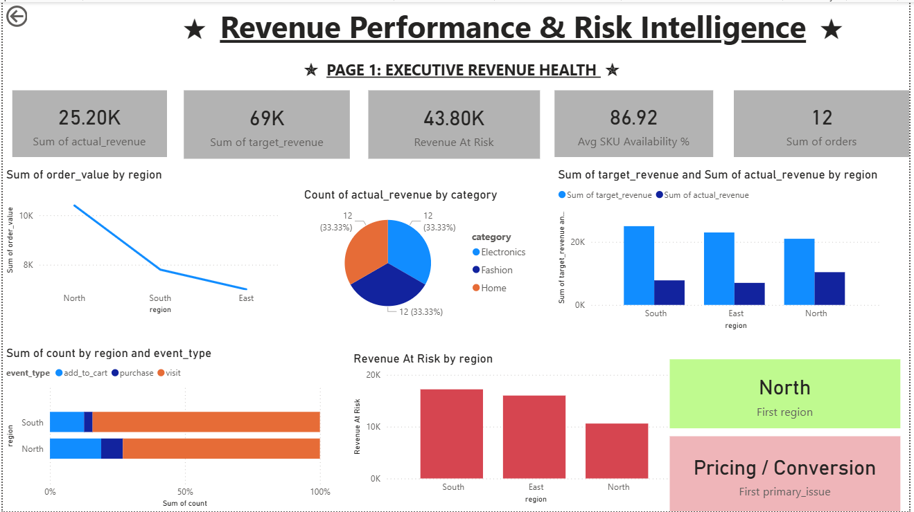
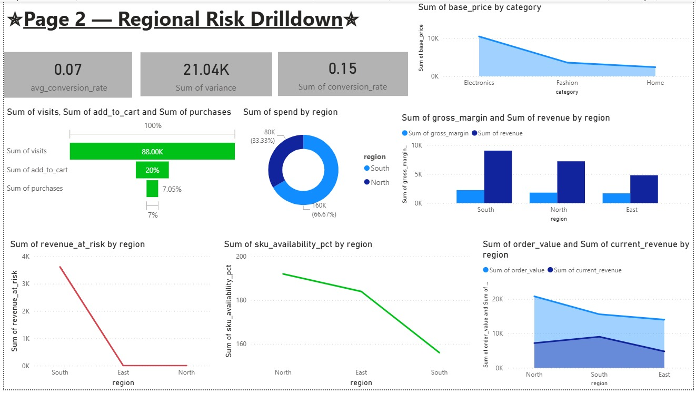
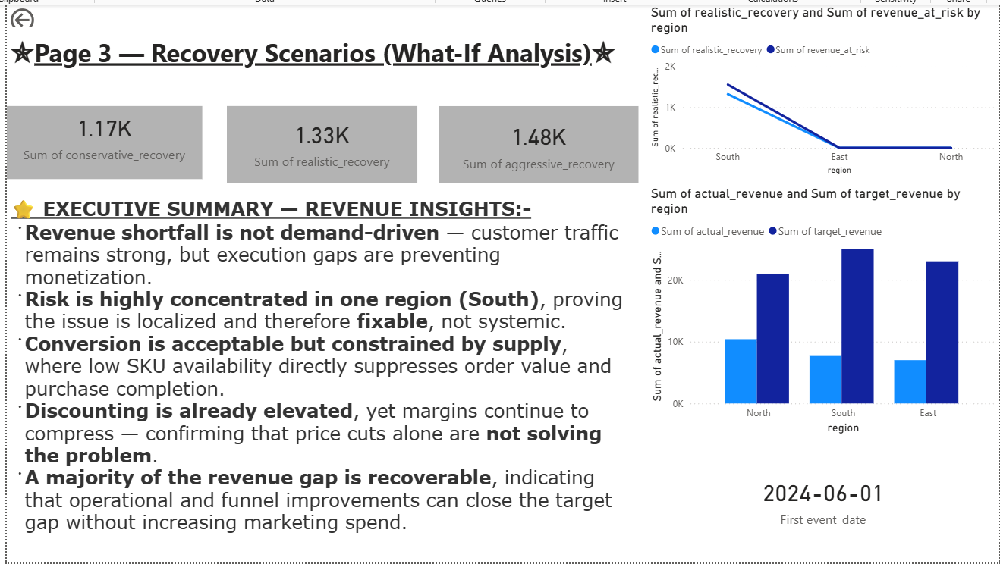

📊 Revenue Performance & Risk Intelligence System
1. Business Problem

Organizations often track revenue actuals, but struggle to answer deeper questions:

Why are we missing targets?

Where exactly is revenue at risk?

How much revenue can realistically be recovered?

Which regions or funnels need immediate attention?

Traditional dashboards show what happened, not what to do next.
This project was built to bridge that gap.

2. Solution Overview

I designed an end-to-end Revenue Intelligence System that compares actual revenue against targets, identifies gaps, quantifies revenue-at-risk, and highlights actionable recovery opportunities across regions and time periods.

The system is built on a proper analytical data model, not flat reports, enabling scalable analysis and executive-level decision making.

3. System Architecture

Data Flow:

Raw Revenue & Target Data
→ SQL Transformation & Star Schema Modeling
→ Analytical Fact Tables
→ Power BI Semantic Layer (DAX)
→ Executive Dashboards & Scenario Analysis
  .
├── data_raw/
│   ├── customers.csv
│   ├── marketing_spend.csv
│   ├── operations.csv
│   ├── orders.csv
│   ├── products.csv
│   ├── targets.csv
│   └── web_events.csv
│
├── data_clean/
│   ├── customers_clean.csv
│   ├── operations_clean.csv
│   ├── orders_clean.csv
│   ├── products_clean.csv
│   ├── targets_clean.csv
│   └── web_events_clean.csv
│
├── sql/
│   └── sql.sql
│
├── python_data_cleaning.py
│
└── README.md

4. Data Modeling (Core Strength)

I designed a star-schema analytical layer in SQL to ensure performance, clarity, and correctness.

Fact Tables:

Revenue Health Fact – actuals, targets, variance

Funnel Conversion Fact – lead → opportunity → revenue

Operational Risk Fact – underperformance drivers

Recovery Scenario Fact – recoverable vs unrecoverable revenue

Dimension Tables:

Date

Region

Product / Business Unit

Sales Channel

This structure enables:

Consistent KPI calculations

Easy time-series analysis

Clean regional and product drilldowns

5. Key Metrics & Logic

Implemented business-accurate metrics, not naive aggregations:

Actual Revenue

Target Revenue

Revenue Variance

Revenue at Risk

Recoverable Revenue

Funnel Conversion Rates

Special care was taken to:

Align actuals and targets across time and region

Avoid double counting

Handle partial-period targets correctly

All calculations were implemented using robust DAX measures.

6. Dashboards & Insights

Built executive-grade Power BI dashboards with:

Executive View

Revenue vs Target

High-risk regions

Recoverable revenue summary

Regional Drilldowns

Region-wise performance gaps

Funnel health comparison

Time-based trends

Scenario Analysis

“If X% recovery is achieved, what happens?”

Prioritization of regions with maximum upside

These dashboards allow leadership to move from data → insight → action in minutes.
## 📊 Dashboards & Insights

### Executive Revenue Overview

This view highlights actual vs target revenue, variance, and revenue at risk across regions.

### Regional Drilldown

Allows leadership to identify underperforming regions and prioritize recovery actions.

### whatt_if analysis

Allows leadership to identify Recovery Scenarios (What-If Analysis)

7. Business Impact

Clear visibility into why targets are missed

Quantification of revenue recovery potential

Faster decision-making for regional leadership

Shift from reactive reporting to proactive revenue management

8. Tools & Technologies

python - for basic data cleaning 

SQL (MySQL) – data modeling & transformations

Power BI – dashboards & visualization

DAX – KPI logic & semantic layer

Dimensional Data Modeling – star schema design

9. Future Enhancements

Automated data ingestion (scheduled refresh)

Predictive revenue risk scoring

Integration with CRM data

Alerting for high-risk regions